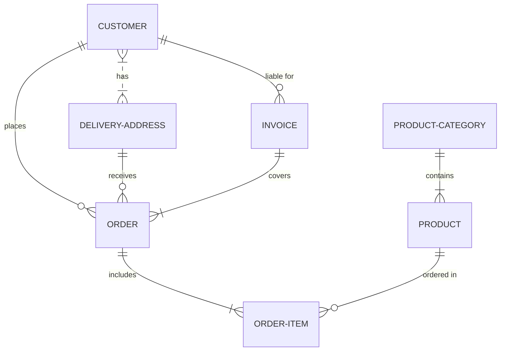

# mermaid-test
Trying some mermaid(.js) art

*star=italic*

**stars=bold**

_uline=italic_

__ulines=bold__

## #1
```mermaid
graph TD;                                                                         
    A-->B;                                                                        
    A-->C;                                                                        
    B-->EndOfFlowchart;                                                                        
    C-->EndOfFlowchart; 
````

## #2
```mermaid
sequenceDiagram                                                                   
    participant Alice                                                             
    participant Bob                                                               
    Alice->>John: Hello John, how are you?                                        
    loop Healthcheck                                                              
        John->>John: Fight against hypochondria                                   
    end                                                                           
    Note right of John: Rational thoughts <br/>prevail!                           
    John-->>Alice: Great!                                                         
    John->>Bob: How about you?                                                    
    Bob-->>John: Jolly good! 
````

## #3
```mermaid
gantt                                                                             
dateFormat  YYYY-MM-DD                                                            
title Adding GANTT diagram to mermaid                                             
excludes weekdays 2014-01-10                                                      
                                                                                  
section A section                                                                 
Completed task            :done,    des1, 2014-01-06,2014-01-08                   
Active task               :active,  des2, 2014-01-09, 3d                          
Future task               :         des3, after des2, 5d                          
Future task2               :         des4, after des3, 5d 
````

## #4
```mermaid
classDiagram                                                                      
Class01 <|-- AveryLongClass : Cool                                                
Class03 *-- Class04                                                               
Class05 o-- Class06                                                               
Class07 .. Class08                                                                
Class09 --> C2 : Where am i?                                                      
Class09 --* C3                                                                    
Class09 --|> Class07                                                              
Class07 : equals()                                                                
Class07 : Object[] elementData                                                    
Class01 : size()                                                                  
Class01 : int chimp                                                               
Class01 : int gorilla                                                             
Class08 <--> C2: Cool label
````

## #4A
```mermaid
classDiagram  
classDiagram
    Animal <|-- Duck
    Animal <|-- Fish
    Animal <|-- Zebra
    Animal : +int age
    Animal : +String gender
    Animal: +isMammal()
    Animal: +mate()
    class Duck{
      +String beakColor
      +swim()
      +quack()
    }
    class Fish{
      -int sizeInFeet
      -canEat()
    }
    class Zebra{
      +bool is_wild
      +run()
    }
```
 
## #5
 ```mermaid
 erDiagram                                                                         
    CUSTOMER ||--o{ ORDER : places                                                
    ORDER ||--|{ LINE-ITEM : contains                                             
    CUSTOMER }|..|{ DELIVERY-ADDRESS : uses 
 ```

## #5A

          
## #6
```mermaid
stateDiagram-v2
 [*] --> New
 New --> Ready: admitted
 Ready --> Running: scheduler dispatch
 Running --> Ready: interrupt
 Running --> Waiting: I/O or event wait
 Waiting --> Ready: I/O or event completion
 Running --> Terminated: exit
 Terminated --> [*]
 ```
 
 ## #7
 ```mermaid
 gitGraph:
options
{
    "nodeSpacing": 150,
    "nodeRadius": 10
}
end
commit
branch newbranch
checkout newbranch
commit
commit
checkout master
commit
commit
merge newbranch
```


